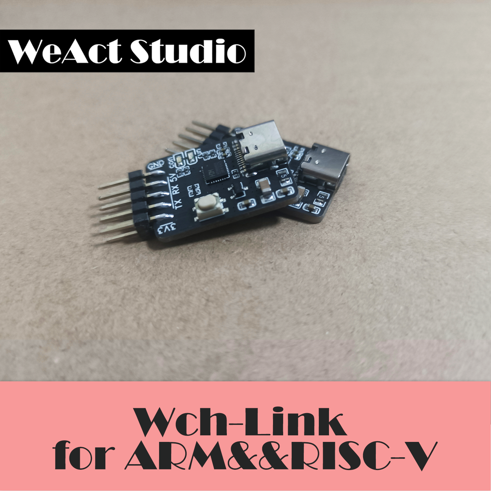

# WeAct-wchlink

## 简介
WCH-Link模块可用于沁恒RISC-V架构MCU在线调试和下载，也可用于带有SWD接口的ARM 内核MCU的在线调试和下载。同时带有1路串口，方便调试输出。 mini版本v1.0  
默认出厂相当于一个mini-daplink

### 特点
    . Type-C 供电；
    . 双电源输出：支持3.3V/5V；
    . debug模式切换： 支持arm内核芯片、沁恒RISC-V；
    . 支持SWD、带串口；
    . 小巧易收纳；
    . 通过按键切换模式，方便快捷；

### 模式切换 
按住key键重新上电，指示灯跳变。后续使用中，wch-link 保持切换后模式。 
出厂默认arm模式

| 模式     |  指示灯  |  IDE |  支持芯片 |
|---|---|---|---|
| RISC-V  |  空闲时con灯常灭 | MounRiver Studio  |  WCH 支持两线调试的 RISC-V 芯片 |
| ARM   | 空闲时con灯常亮   | Keil&openocd&...    |  支持 SWD 协议的 ARM 核芯片  |

## 虚拟串口及支持波特率
wchlink支持波特率如下： 
1200 2400 4800 9600 14400 19200 38400 57600 115200 230400 
这些波特率基本上够用了。 

## 驱动安装

## 外形图：

## 尺寸图：

## Using steps：
 1.Install the wchlink driver ---------Drv   
 2.Read Doc--------------------------Doc    
 3.Using wchlink by Tools -----------Tools   

## important : 
it is a daplink for ARM,and it can be a RISV-V debugger for Qingheng risc-v mcu.